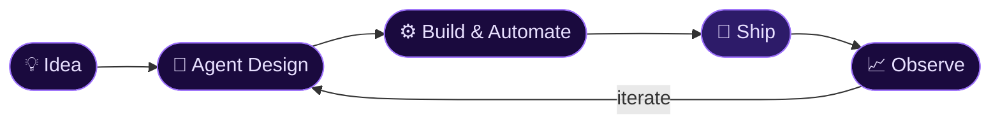

<div align="center">


<br>

[](https://github.com/imanaswer)

<br>

<a href="#-about-me"></a>
<a href="#%EF%B8%8F-arsenal"></a>
<a href="#-github-analytics"></a>
<a href="#-lets-connect"></a>

</div>

<br>

---

## ⚡ About Me

<table width="100%" border="0">
<tr>
<td width="52%" valign="top">

```python
class AnaswerAjay:
    role     = "Software Engineer"
    focus    = ["Agentic AI", "DevOps", "Automation"]
    stack    = ["Python", "Django", "FastAPI", "Cloud"]
    based_in = "Kerala, India 🌴"
    status   = "Building things that think"

    def current_mission(self):
        return "autonomous systems that scale"
```

I engineer **autonomous AI systems** and **automation pipelines** that scale. My work sits at the intersection of backend architecture and intelligent agents — building software that doesn't just run, but *reasons*.

When I'm not writing code, I'm either reading a crime thriller or wondering how far the nearest star really is. 🔭

</td>
<td width="2%"></td>
<td width="46%" valign="top" align="center">

<a href="https://github.com/imanaswer">
  
</a>

<a href="https://github.com/imanaswer">
  
</a>

</td>
</tr>
</table>

<br>

<div align="center">

### 🐍 Watch the snake devour my contributions


</div>

<br>

---

## 🛠️ Arsenal

<div align="center">


<br>

<br>


</div>

<br>

<details>
<summary><b>🧠 &nbsp;Agentic AI & Machine Learning</b> — <i>click to expand</i></summary>
<br>

&nbsp;&nbsp;`LLM Orchestration` · `Autonomous Agents` · `RAG Pipelines` · `TensorFlow` · `Prompt Engineering` · `Tool-Use / Function Calling`

Building agents that plan, reason, and execute — not just chatbots. Multi-step workflows, self-correction loops, and memory systems.

</details>

<details>
<summary><b>⚙️ &nbsp;Backend & Architecture</b> — <i>click to expand</i></summary>
<br>

&nbsp;&nbsp;`Python` · `Django` · `FastAPI` · `PostgreSQL` · `Redis` · `REST / Async APIs`

High-throughput services, clean domain modelling, and databases that don't fall over at 3 AM.

</details>

<details>
<summary><b>☁️ &nbsp;DevOps & Cloud</b> — <i>click to expand</i></summary>
<br>

&nbsp;&nbsp;`AWS` · `Docker` · `CI/CD` · `Linux` · `Nginx` · `Infrastructure Automation`

If it can be automated, it will be. Pipelines that deploy themselves while I sleep.

</details>

<br>

<div align="center">



</div>

<br>

---

## 📊 GitHub Analytics

<div align="center">


<br><br>

[](https://github.com/imanaswer)

<br>

[](https://github.com/imanaswer)

</div>

<br>

---

## 🤝 Let's Connect

<div align="center">

<a href="https://www.linkedin.com/in/anaswerajay/">
  
</a>
&ensp;
<a href="mailto:anaswer.impluse@gmail.com">
  
</a>
&ensp;
<a href="https://github.com/imanaswer">
  
</a>

<br><br>


<br><br>

[](https://github.com/imanaswer)


</div>
