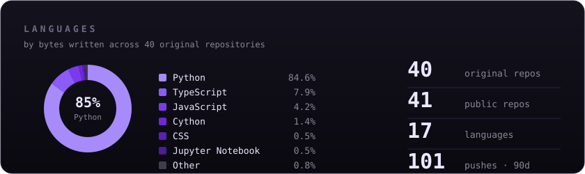
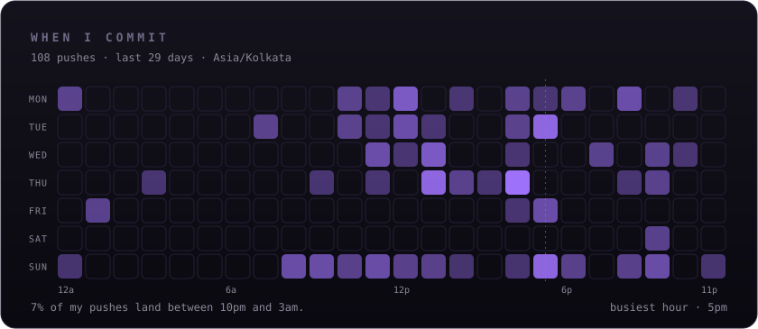

### Anaswer Ajay

Founding Engineer, <a href="https://gameground.net">Game Ground</a> · Prev SWE intern @ Google & Jane Street · <a href="https://anaswer-os.vercel.app">anaswer-os.vercel.app</a>

 

I pick problems before tools. The tools I learn on the way.

That's how I ended up interning on Search Ranking at Google and at Jane Street in London, then walking away from that track to build a sports marketplace in Kozhikode. Not because startups are romantic. Because comfort bores me, and nobody was solving this problem where I live.

**Currently:** Founding Engineer at [Game Ground](https://gameground.net) — a hyperlocal sports marketplace live in Kerala since June 2026. 800+ active users, 19 coaches onboarded, real money moving through Razorpay. I've caught two payment vulnerabilities before they hit production and migrated us off a JSON-file database onto PostgreSQL with zero downtime. Open to backend, AI engineering, and forward-deployed roles — remote, or hybrid in India.

 

## Selected work

| | |
|---|---|
| [**Game Ground**](https://gameground.net) | The sports marketplace I build full-time. Bookings, payments, coach onboarding, a reputation system. The war stories: an HMAC webhook bypass and a double-booking race condition, both caught pre-production. Next.js · Prisma · Supabase · Razorpay |
| [**StreamForge**](https://github.com/imanaswer/kafka) | A distributed event streaming platform inspired by Kafka, built in Go. Raft-backed metadata, segment-based log storage, ISR replication, and a live dashboard for watching the cluster work — and fail. Go · Raft · Next.js |
| [**LLM Inference Gateway**](https://github.com/imanaswer/LLM-GATEWAY) | A proxy that dynamically batches LLM API requests to maximize throughput while holding per-client latency SLOs. OpenAI-compatible REST plus gRPC. Go · Python · Docker |
| [**Event Processing Platform**](https://github.com/imanaswer/Stripe-style-Event-Processing-Platform) | Stripe-style webhook plumbing: idempotent ingest, Kafka fan-out, exponential-backoff retries, dead-letter queue. Redis on the hot path, Postgres for durable state. Python · Kafka · Redis · PostgreSQL |
| [**AI Support Agent**](https://github.com/imanaswer/AI-Customer-Support-Agent) | Production-style support agent: RAG over a knowledge base, Claude agent loop with tool calling, confidence gating with a human escalation queue, every conversation logged to a CRM. FastAPI · Claude · SQLite |

[All repositories →](https://github.com/imanaswer?tab=repositories)

 

## By the numbers

Both cards are generated from live GitHub data by [a scheduled Action](.github/workflows/stats.yml) and committed into this repo — no third-party service to go down.

 

## Writing

I write about what actually happened — the bug, the migration, the night it broke.

| Post | On |
|---|---|
| [**The JSON database that almost killed us**](https://www.linkedin.com/in/anaswerajay/) | We ran a live marketplace on JSON files longer than anyone should. How the migration to PostgreSQL went, and what broke on the way. |
| [**Two payment bugs that never shipped**](https://www.linkedin.com/in/anaswerajay/) | An HMAC webhook bypass and a booking race condition. What catching them taught me about trusting the client. |
| [**Building an app to learn Italian**](https://www.linkedin.com/in/anaswerajay/) | I wanted to learn a language, so obviously I built software instead of studying. It worked anyway. |

 

## Elsewhere

**800+ users on a product I built. Shipped before the résumé said I could.**

[anaswer-os.vercel.app](https://anaswer-os.vercel.app) · [LinkedIn](https://www.linkedin.com/in/anaswerajay/) · [Email](mailto:anaswer.impluse@gmail.com)
